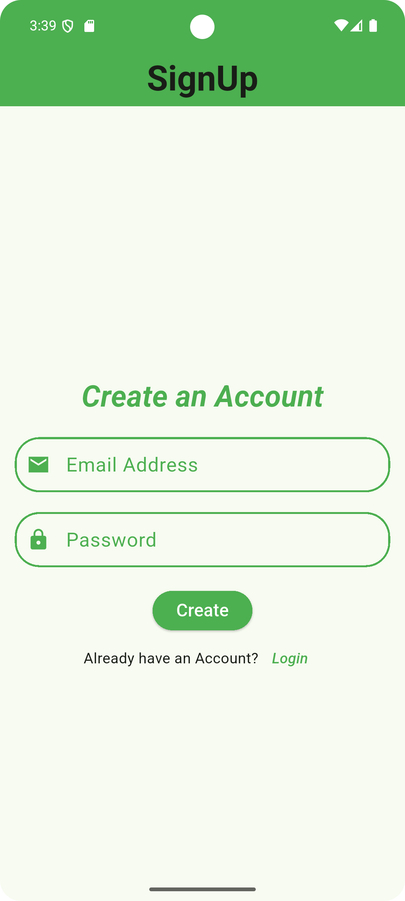
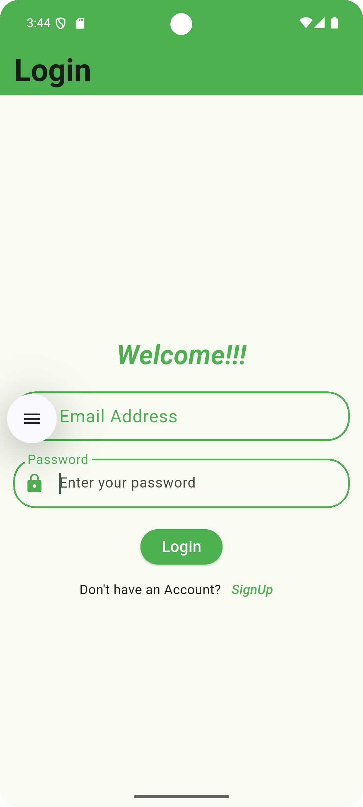
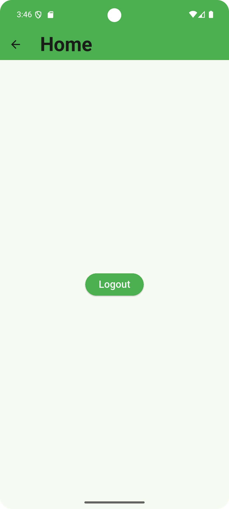

# TeslaTask1

Firebase Authentication
1.Simple login/signup with email & password.
2.Only logged-in users can access home.
3.Logout functionality returns to login screen.

## How to run this project?
```bash
git clone https://github.com/SuPriya112K/TeslaTask1.git
cd TeslaTask1
flutter pub get
flutter run
```

## App Screenshots

### SignUp Screen


### Login Screen


### Home Screen
